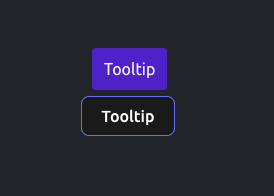

# Готовые компоненты проекта

### SmartIcon
Универсальный компонент для рендеринга SVG-иконок из определенной директории (`/src/shared/assets/icons`)

! Перед использованием необходимо сгенерировать коллекцию иконок в директории,
для этого выполнить команду `npm run gen:icons`;

### Tooltip
Компонент всплывающей подсказки
 

### 