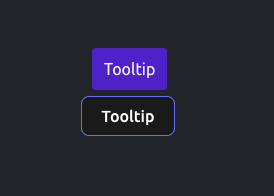
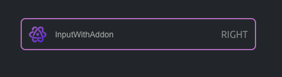
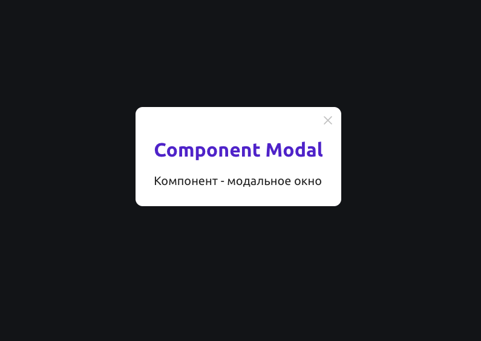
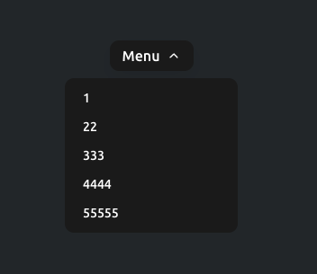
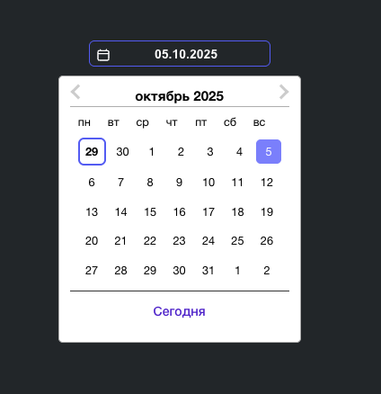

# Готовые компоненты проекта

### [SmartIcon](../src/shared/ui/smart-icon/SmartIcon.tsx)
Универсальный компонент для рендеринга SVG-иконок из определенной директории (`/src/shared/assets/icons`)

! Перед использованием необходимо сгенерировать коллекцию иконок в директории,
для этого выполнить команду `npm run gen:icons`;

### [Tooltip](../src/shared/ui/tooltip/Tooltip.tsx)
Компонент всплывающей подсказки
<br/>


### [SmartImage](../src/shared/ui/smart-image/SmartImage.tsx)
<br/>
Изображение которое масштабируется по меньшей стороне

### [InputWithAddon](../src/shared/ui/input-with-addon/InputWithAddon.tsx)
Поле ввода с дополнительными элементами (слева/справа)
<br/>


### [Modal](../src/shared/ui/modal/ui/Modal.tsx)
Компонент - модальное окно
```tsx
<Modal active={isActive} closeFunc={onCloseModal}>
    <div>
        <h1 style={{
            color: '#4e22c9',
        }}>Component Modal</h1>

        <span style={{
            color: '#202020',
            fontSize: '20px'
        }}
        >
			Компонент - модальное окно
		</span>
    </div>
</Modal>
```
<br/>


### [DropDownMenu](../src/shared/ui/drop-down-menu/DropDownMenu.tsx)
Компонент DropdownMenu — выпадающее меню с поддержкой кастомизации,
позиционирования и управления клавиатурой.
<br/>


### [DatePickerApp](../src/shared/ui/date-picker/DatePickerApp.tsx)
Поле ввода даты (обертка над react-datepicker)
<br/>


